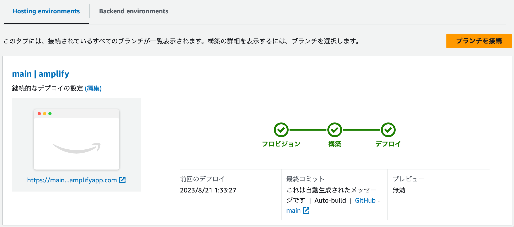

## 前提条件

#### Amplify CLI のインストール

```sh
npm install -g @aws-amplify/cli
```

#### Next.jsアプリケーションの作成

```sh
# プロジェクトのルートディレクトリで以下のコマンドを実行する
npm init next-app

✔ What is your project named? … amplify
✔ Would you like to use TypeScript? … Yes
✔ Would you like to use eslint? … Yes
✔ would you like to use tailwind css? … Yes
✔ would you like to use `src/` directory? … Yes
✔ would you like to use app router? (recommended) … Yes
✔ would you like to customize the default import alias? … No
```

#### Amplify ホスティングの追加

SSR アプリをデプロイするときは `Distribution Directory Path:` に `.next` を設定する。

AWSマネジメントコンソールで GitHub ブランチに接続し設定をする。



## 参考資料

- https://docs.amplify.aws/guides/hosting/nextjs/q/platform/js/#deploy-and-host-a-hybrid-app-ssg-and-ssr
