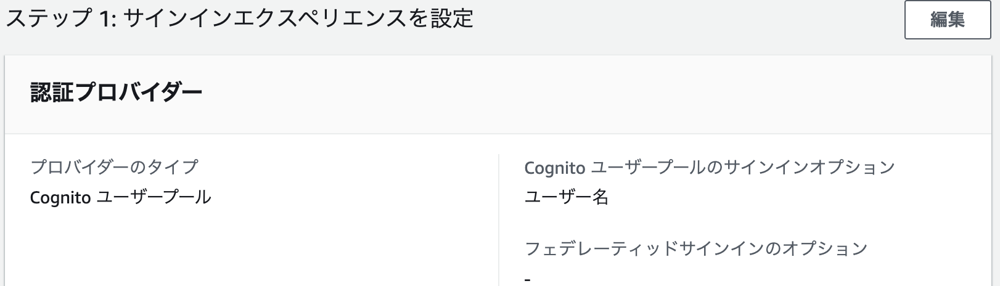
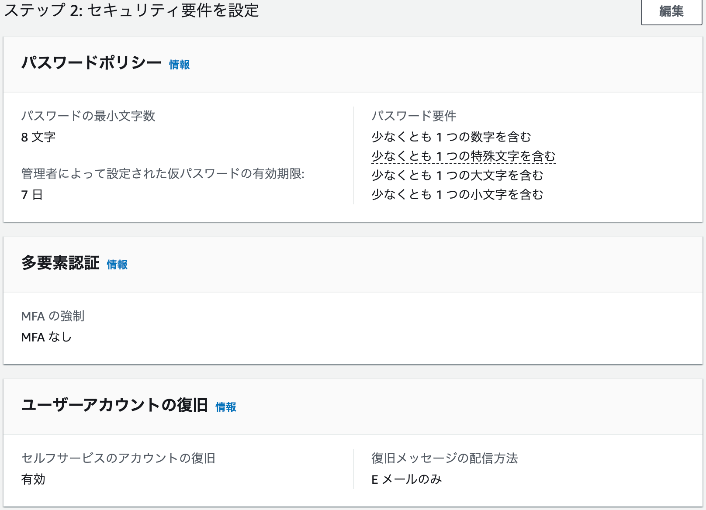
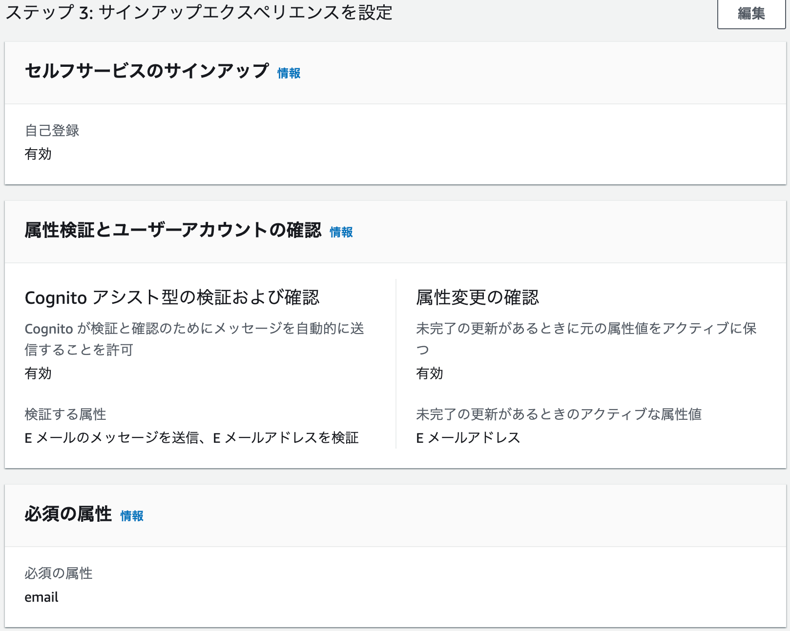
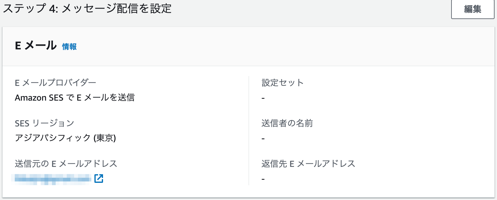
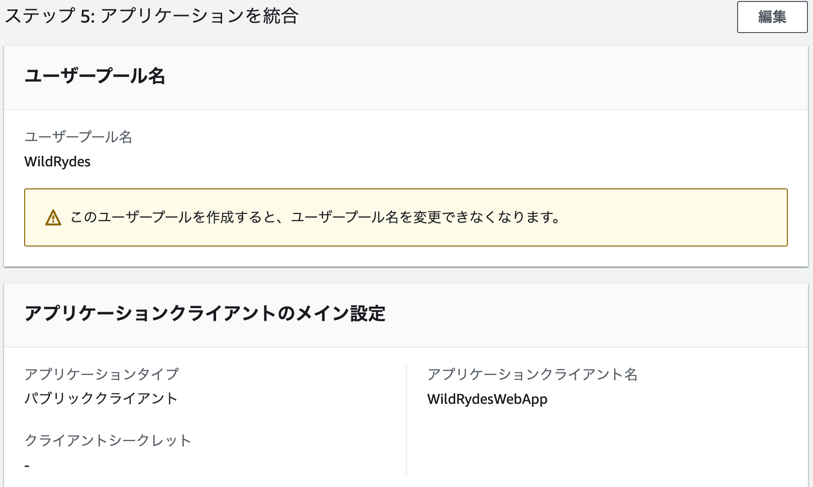

## ユーザーを管理する（Amazon Cognito）

ユーザーアカウントを管理するために、Amazon Cognito ユーザープールを作成する。顧客が新規ユーザーとして登録し、電子メール アドレスを確認し、サイトにサインインできるページを展開する。

### ユーザープールの作成

- Cognito ユーザープールを選択しサインインオプションにユーザー名を選択したら次へ。

- MFAなしを選択しあとはデフォルトのままで次へ。

- デフォルトのままで次へ。

- SES で検証済みのメールアドレスを入力して次へ。

- ユーザープール名、アプリケーションクライアント名を入力して次へ。

